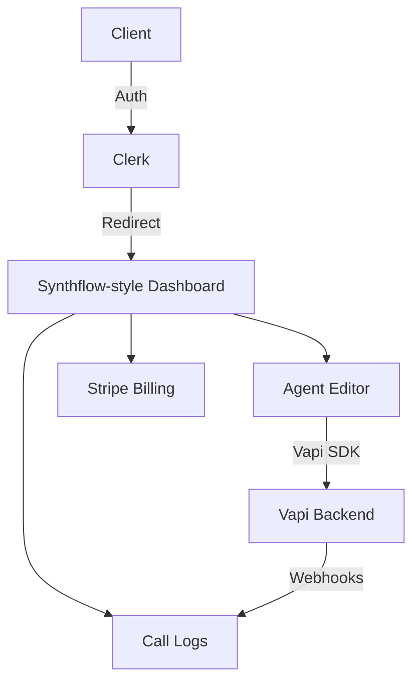

# Vapi Voice Agent Platform Implementation Plan (Synthflow Style)

I will build a premium-tier voice agent platform with a sleek, minimalist UI inspired by Synthflow. The focus is on a phased delivery starting with core agent management, call logs, and billing.

## Phase 1: Core Foundation & UI (Current Priority)

### 1. Aesthetic & Layout (Synthflow Inspired)

- **Sidebar**: High-contrast minimalist sidebar with sections for Analytics, Agents, Call Logs, Billing, and Settings.
- **Theme**: Light/Dark mode support with a focus on clean typography (Inter/Geist) and subtle shadows.
- **Agent Dashboard**: "Empty State" with large action cards ("Start from Scratch", "Templates").

### 2. Client Account Types

- **Type A (Custom)**: Client provides their own Vapi Key/Org. Platform is just a management layer.
- **Type B (Umbrella)**: Client uses Agency credentials. Usage is restricted by prepaid credits.

### 3. Feature Set

- **Editable AI Agents**: Dynamic configuration of Vapi properties (Voice, Prompt, Speed, etc.).
- **Call Logs**: Detailed list of calls, durations, costs, and recordings fetched via Vapi.
- **Billing Section**: Stripe-integrated dashboard for managing subscriptions and topping up minutes.

## Implementation Details

### Database Schema (Supabase)

- `clients`: `id`, `name`, `email`, `account_type` (CUSTOM/UMBRELLA), `vapi_key`, `vapi_org_id`, `balance`.
- `agents`: `id`, `client_id`, `vapi_id`, `name`, `config` (JSON).
- `calls`: `id`, `client_id`, `agent_id`, `duration`, `recording_url`, `transcript`, `cost`.

## Key Files

- `src/components/layout/sidebar.tsx`: The Synthflow-style navigation.
- `src/app/dashboard/agents/page.tsx`: Grid/List view of agents with "Create New" cards.
- `src/app/dashboard/logs/page.tsx`: Table view for call logs.